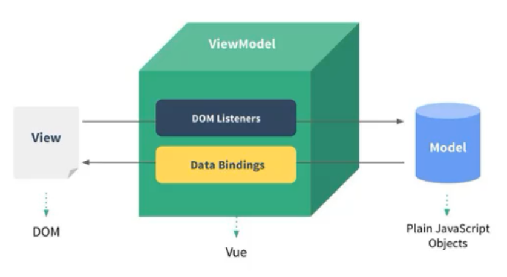
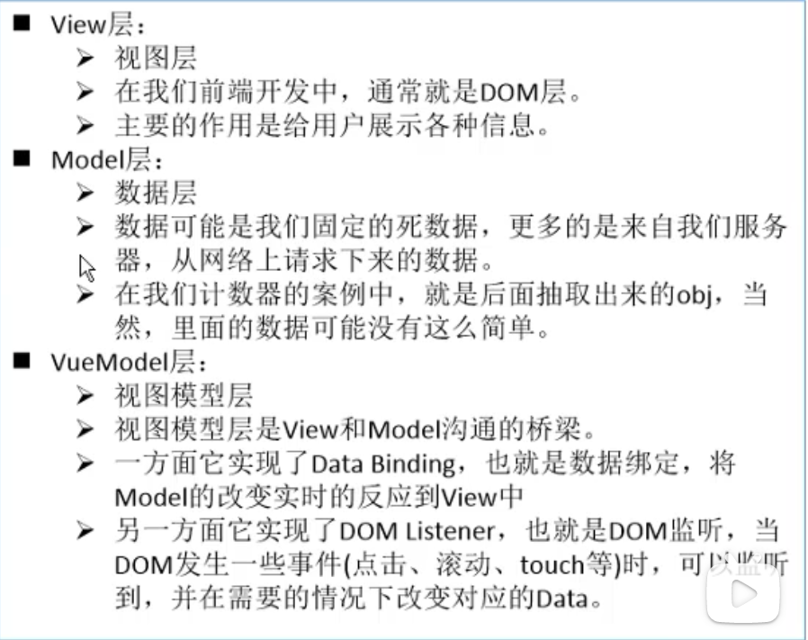

# Vue学习笔记

## 属性

| 属性名称 | 类型                      | 作用                                                         |
| -------- | ------------------------- | ------------------------------------------------------------ |
| el       | string \| HTMLElement     | 决定之后Vue实例会管理哪个DOM                                 |
| data     | Object \| Function        | Vue实例对应的数据对象（组件当中data必须是一个函数）          |
| methods  | {[key: string]: Function} | 用于在Vue对象中定义方法 可以在其他地方调用，也可以在指令中使用 |

## 指令

| 指令名称     | 作用                                                         |
| :----------- | :----------------------------------------------------------- |
| @click(v-on) | 该指令用于监听某个元素的点击事件， 并且需要指定当发生点击时执行的方法（方法通常是methods中定义的方法） |

## 概念讲解

1. 什么是MVVM（Model View View Model）?
   - 通常我们学习一个概念，最好的方式是去看维基百科
   - https://zh.wikipedia.org/wiki/MVVM
2. Vue中的MVVM

